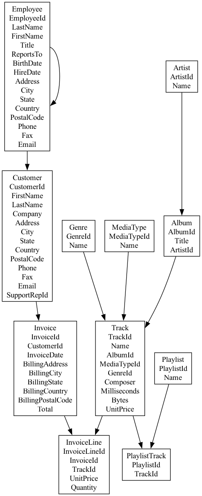

# Overview

Using the Chinook DB to experiment with LLMs for structured, tabular data.

More info on the Chinook DB: https://database.guide/2-sample-databases-sqlite/

The goal of this PoC is to build a DBCopilot using OpenAI and LangChain, using LangChain's SQL Agent component. 

Here is the original paper on DBCopilots: https://arxiv.org/abs/2312.03463

# Data Model
